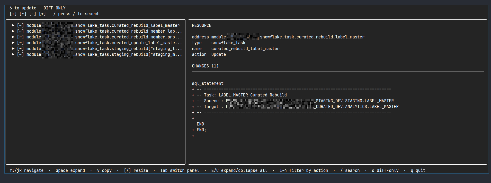

# tofu-diff

A terminal-based viewer for [OpenTofu](https://opentofu.org/) plan files that renders infrastructure changes in a human-readable, diff-style format — both as an interactive TUI and as plain text output.


## Preview



_Interactive view rendered from the bundled `data/binary.plan` fixture._

## Features

- **Interactive TUI** — Browse resources, expand attribute diffs, search, and filter by action type (create / update / destroy / replace)
- **Plain-text mode** — Piped output renders clean diffs without ANSI escapes
- **Unified diffs** — Side-by-side before/after with LCS-based alignment and JSON syntax highlighting
- **Binary plan support** — Reads both `tofu show -json` output and native binary plan files (protobuf-based)
- **Sensitive value handling** — Respects OpenTofu's sensitive value markers
- **`(known after apply)` markers** — Distinguishes computed values from concrete changes

## Quick Start

### Install

```bash
go install github.com/ducva/tofu-diff@latest
```

### Usage

```bash
# Generate a JSON plan from OpenTofu
tofu plan -out=tfplan
tofu show -json tfplan > plan.json

# View it interactively (TUI)
tofu-diff plan.json

# View it in plain-text (pipe to a file or another command)
tofu-diff plan.json | less

# View a binary plan directly
tofu-diff tfplan
```

### TUI Controls

| Key           | Action                         |
| ------------- | ------------------------------ |
| `↑` / `↓` or `j` / `k` | Navigate resources   |
| `Space`       | Expand / collapse              |
| `y`           | Copy the selected resource     |
| `[` / `]`     | Resize panels                  |
| `Tab`         | Switch panel                   |
| `E` / `C`     | Expand / collapse all          |
| `1` – `4`     | Toggle action filter           |
| `/`           | Search resources               |
| `o`           | Toggle diff-only mode          |
| `q`           | Quit                           |

## How It Works

`tofu-diff` parses OpenTofu plan data into a structured `PlanFile` model, then renders it through one of two backends:

1. **TUI mode** (terminal detected) — Uses [Bubble Tea](https://github.com/charmbracelet/bubbletea) with a two-panel layout: a resource list on the left and a detailed unified diff on the right.
2. **Plain-text mode** (stdout not a terminal) — Produces clean, pipe-friendly output with `[+]` / `[-]` / `[~]` action markers.

For binary plans (ZIP-wrapped protobuf), it decodes the `tfplan` entry using the OpenTofu protobuf schema and converts values from msgpack to JSON — including handling of standard `cty.UnknownVal` markers (extension type 0) and refined unknown values (extension type 12).

## Supported Plan Formats

| Format                   | Extension | Generated by                              |
| ------------------------ | --------- | ----------------------------------------- |
| JSON plan                | `.json`   | `tofu show -json <planfile>`              |
| Binary plan (protobuf)   | `.plan`   | `tofu plan -out=<planfile>`               |

## Project Structure

```
tofu-diff/
├── cmd/tofu-diff/                 # Canonical executable entry point
├── internal/cli/                  # Flags, source selection, and TTY dispatch
├── internal/plan/
│   ├── domain/                    # Plan semantics and attribute diff rules
│   ├── application/               # Inspect-plan use case and ports
│   └── ingestion/                 # JSON and native OpenTofu anti-corruption layer
├── internal/presentation/
│   ├── text/                      # Pipe-friendly output adapter
│   ├── tui/                       # Interactive Bubble Tea adapter
│   └── valuefmt/                  # Shared compact value formatting
├── main.go                        # Compatibility entry point for go install
├── docs/assets/                   # README images
└── okf/                           # Repository knowledge
```

## Requirements

- Go 1.26+

## License

MIT © Resola AI
